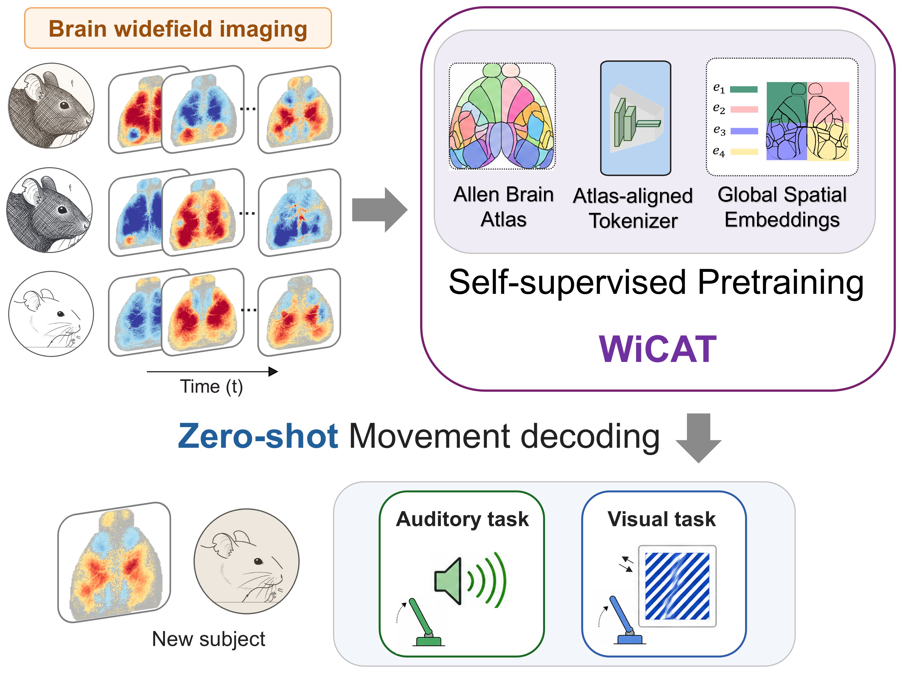

# WiCAT

WiCAT is a foundation model for multi-subject widefield calcium imaging.
It learns shared brain-wide representations across subjects using
atlas-aligned spatiotemporal tokenization, global spatial embeddings, and
self-supervised masked reconstruction. In the paper, these representations
support cross-subject behavior decoding, zero-shot decoding in unseen subjects,
cross-dataset transfer, and left-out brain region reconstruction.

**Paper:** Sayed Mohammad Hosseini, Eray Erturk, Saba Hashemi, and Maryam M.
Shanechi, [_WiCAT: Cross-Subject Modeling of Widefield Imaging Neural
Data_](https://openreview.net/forum?id=pZq2RMptsQ).

This repository provides a compact public release focused on using pretrained
WiCAT models. It implements the WiCAT forward model, pretrained checkpoint
loading, frozen-representation extraction, and downstream finetuning of a
lightweight behavioral decoder. The release is intended as a practical starting
point for applying WiCAT representations to behavior decoding experiments.

<p align="center">
  
</p>

## Table of Contents

- [Repository Scope](#repository-scope)
- [Installation](#installation)
- [Pretrained Checkpoints](#pretrained-checkpoints)
- [Run a Finetuning Example](#run-a-finetuning-example)
- [Finetuning Workflow](#finetuning-workflow)
- [Dataset Sources](#dataset-sources)
- [Processing Full Datasets](#processing-full-datasets)
- [Finetuning on Your Own Segments](#finetuning-on-your-own-segments)
- [Citation](#citation)
- [License](#license)

## Repository Scope

This release includes:

- WiCAT tokenizer and Transformer backbone definitions for widefield movies.
- Pretrained WiCAT encoder checkpoints for Musall and multi-dataset experiments.
- Forward-model utilities for loading checkpoints and extracting frozen
  representations.
- A lightweight MLP decoder for time-resolved behavioral regression.
- Example YAML configs for model setup, decoder finetuning, and dataset
  processing.
- Processing utilities for the Musall and Kondo widefield datasets.
- A small processed Musall-style example dataset for testing the finetuning
  workflow.

The main tutorial entry point is [`wicat/train.py`](wicat/train.py). It loads a
pretrained WiCAT encoder, freezes the tokenizer and Transformer backbone,
spatially pools the latent tokens at each time point, trains a downstream
decoder, saves the decoder head, and runs a sample forward pass.

## Installation

Create an environment and install dependencies:

```bash
cd /path/to/WiCAT

conda create -n wicat python=3.11 -y
conda activate wicat

pip install -r requirements.txt
```

Use a CUDA-enabled PyTorch/xFormers build when running on GPU. To run on CPU,
edit the train YAML and set:

```yaml
device: cpu
dtype: float32
```

## Pretrained Checkpoints

Large raw checkpoints are stored as split archives under
`pretrained_models/pret_weights/`.

Restore the all-dataset checkpoint:

```bash
cat pretrained_models/pret_weights/best-model-all.z01 \
    pretrained_models/pret_weights/best-model-all.z02 \
    pretrained_models/pret_weights/best-model-all.z03 \
    pretrained_models/pret_weights/best-model-all.z04 \
    pretrained_models/pret_weights/best-model-all.z05 \
    pretrained_models/pret_weights/best-model-all.zip \
    > pretrained_models/pret_weights/best-model-all.full.zip

unzip pretrained_models/pret_weights/best-model-all.full.zip -d pretrained_models/
```

Restore the Musall checkpoint:

```bash
cat pretrained_models/pret_weights/best-model-musall.z01 \
    pretrained_models/pret_weights/best-model-musall.z02 \
    pretrained_models/pret_weights/best-model-musall.z03 \
    pretrained_models/pret_weights/best-model-musall.z04 \
    pretrained_models/pret_weights/best-model-musall.z05 \
    pretrained_models/pret_weights/best-model-musall.zip \
    > pretrained_models/pret_weights/best-model-musall.full.zip

unzip pretrained_models/pret_weights/best-model-musall.full.zip -d pretrained_models/
```

The checkpoints are PyTorch state dictionaries containing tokenizer and
Transformer backbone parameters. They are loaded by
[`wicat/model_setup.py`](wicat/model_setup.py) and are compatible with the model
definition in [`wicat/config/model.yaml`](wicat/config/model.yaml).

## Run a Finetuning Example

The example uses processed Musall-style segments in
[`pretrained_models/dataset/`](pretrained_models/dataset/) and the metadata table
[`pretrained_models/metadata_5257c_local10.csv`](pretrained_models/metadata_5257c_local10.csv).

Fit a regression decoder using the Musall pretrained encoder:

```bash
python -m wicat.train --config wicat/config/train.yaml
```

Fit a regression decoder using the all-dataset pretrained encoder:

```bash
python -m wicat.train --config wicat/config/train_all.yaml
```

The two example configs are:

- [`wicat/config/train.yaml`](wicat/config/train.yaml): Musall pretrained encoder.
- [`wicat/config/train_all.yaml`](wicat/config/train_all.yaml): multi-dataset
  pretrained encoder.

The training script:

1. Loads metadata from `metadata_csv`.
2. Builds the tokenizer, backbone, and decoder from
   [`wicat/config/model.yaml`](wicat/config/model.yaml) and
   [`wicat/config/decoder.yaml`](wicat/config/decoder.yaml).
3. Loads the pretrained encoder checkpoint from `checkpoint_path`.
4. Freezes tokenizer and Transformer backbone parameters.
5. Trains the decoder MLP with MSE loss against `kinem`.
6. Saves the decoder head to `training.save_decoder_path`.
7. Runs a sample forward pass and prints output shape/dtype.

For the default Musall example, a sample has 205 time bins, 16 spatial patches
per time bin, and 512-dimensional latent tokens. After spatial pooling, the
decoder receives a `[batch, 205, 512]` sequence and predicts
`[batch, 205, d_kinem]`.

## Finetuning the Pretrained Model

Finetuning is controlled by a single YAML file. Key fields are:

```yaml
checkpoint_path: pretrained_models/best-model-all.ckpt
metadata_csv: pretrained_models/metadata_5257c_local10.csv
model_config: wicat/config/model.yaml
decoder_config: wicat/config/decoder.yaml
device: cuda
dtype: float32

training:
  train_decoder: true
  epochs: 20
  lr: 0.001
  weight_decay: 0.0001
  save_decoder_path: pretrained_models/decoder_head.pt
```

During finetuning, WiCAT maps each widefield movie to latent tokens with the
pretrained tokenizer/backbone. The encoder remains frozen, and only the
task-specific decoder is trained. The default decoder in
[`wicat/models/MLP.py`](wicat/models/MLP.py) operates on spatially pooled latent
tokens, so predictions remain time-resolved. This setup is useful for behavior
decoding targets such as kinematics, movement variables, or trial-aligned
continuous regressors.

To run a larger finetuning experiment:

1. Process Musall or Kondo segments using the dataset commands below.
2. Point `metadata_csv` to the generated `metadata_<hash>.csv`.
3. Select a pretrained checkpoint with `checkpoint_path`.
4. Adjust decoder dimensions in [`wicat/config/decoder.yaml`](wicat/config/decoder.yaml)
   if your behavioral target has a different `d_kinem`.
5. Run:

```bash
python -m wicat.train --config /path/to/your_train_config.yaml
```

## Dataset Sources

### Musall / Churchland Widefield Dataset

Source page:

- [CSHL repository item 38944](https://repository.cshl.edu/id/eprint/38944/)

The Musall loader downloads from the LabShare widefield storage area linked by
the CSHL repository page. The current loader uses:

```text
https://labshare.cshl.edu//shares/library/repository/38599/Widefield/
```

Expected raw layout after download:

```text
data/musall_raw/
  mSM30/
    10-Oct-2017/
      *.mat
      BehaviorVideo/
        *.mat
        SVD_CombinedSegments.mat
        motionSVD_CombinedSegments.mat
    12-Oct-2017/
      ...
  mSM34/
    ...
```

The sessions processed by default are listed in
`wicat/data/musall_dataset.py::available_sessions`.

### Kondo Widefield Dataset

Source pages:

- [Scientific Data article](https://www.nature.com/articles/s41597-025-05482-y)
- [BraiDyn-BC Database](https://braidyn-bc-database.netlify.app/)

The Kondo dataset is distributed in NWB format. The Scientific Data paper
describes 25 mice, 15 task sessions over learning, resting-state/sensory
recordings, and both raw and preprocessed data.

Expected raw layout after downloading NWB files:

```text
data/kondo_raw/
  sub-VG1-GC105/
    sub-VG1-GC105_ses-2024-01-24-task-day1.nwb
    sub-VG1-GC105_ses-2024-01-24-resting-state-day1.nwb
    ...
  sub-VG1-GC53/
    ...
```

The Kondo loader scans `sub-*/*.nwb`, parses
`ses-YYYY-MM-DD-{task,resting-state,sensory-stim}-dayN`, and writes a cache at:

```text
data/kondo_processed/raw/session_info_cache.json
```

## Processing Full Datasets

The dataset constructors run the full data lifecycle:

1. Check/download raw data.
2. Stage 1: convert raw files to processed full-session files.
3. Stage 2: convert processed full-session files to trial/chunk segments and
   metadata.

The relevant YAML files are:

- Musall: `wicat/config/data/musall_wf.yaml`
- Kondo: `wicat/config/data/kondo_wf.yaml`

Update these paths before processing:

```yaml
config:
  save_dir: ./data/musall_processed
  raw_data_base_dir: ./data/musall_raw
  raw_data_dir: ./data/musall_raw
```

or:

```yaml
config:
  save_dir: ./data/kondo_processed
  raw_data_dir: ./data/kondo_raw
  processed_data_dir: ./data/kondo_processed
```

The stage flags are:

```yaml
force_reprocess_stage1: false
force_reprocess_stage2: false
```

Set either flag to `true` to force regeneration.

### Process Musall

From the repository root:

```bash
python - <<'PY'
from omegaconf import OmegaConf
from wicat.data import MusallImagingDataset

cfg = OmegaConf.load("wicat/config/data/musall_wf.yaml")
dataset = MusallImagingDataset(cfg.dataset.config)

print("Metadata:", dataset.metadata_path)
print("Segments:", dataset.processed_segments_data_dir)
PY
```

Musall stage 1:

- Downloads MATLAB files if `data/musall_raw/download_complete.done` is absent.
- Loads the widefield SVD data and behavior files.
- Reconstructs/normalizes the imaging representation.
- Saves processed full-session files under `processed_raw...`.

Musall stage 2:

- Reconstructs trial movies from `U @ Vc`.
- Saves segment `.pt` files containing `imaging`, `kinem`, `vc`, and `z_bin`.
- Writes `metadata_<hash>.csv` in `save_dir`.

### Process Kondo

First download the NWB files from the Kondo dataset source and place them under
`data/kondo_raw/` in the layout shown above. Then run:

```bash
python - <<'PY'
from omegaconf import OmegaConf
from wicat.data import KondoWidefieldDataset

cfg = OmegaConf.load("wicat/config/data/kondo_wf.yaml")
dataset = KondoWidefieldDataset(cfg.dataset.config)

print("Metadata:", dataset.metadata_path)
print("Segments:", dataset.processed_segments_data_dir)
PY
```

Kondo stage 1:

- Scans NWB files under `raw_data_dir`.
- Extracts widefield blue/UV imaging, behavior keypoints, sensory/task signals,
  trial tables, timestamps, and atlas transforms.
- Applies preprocessing from `wicat/data/musall_utils.py`.
- Saves processed full-session files under `processed_raw...`.

Kondo stage 2:

- Builds task-aligned trial segments and resting-state chunks.
- Selects behavior dimensions used by the default decoder task.
- Filters bad chunks using thresholds in the dataset config.
- Saves segment `.pt` files containing `imaging`, `kinem`, `binary_beh`,
  `subject`, and `session`.
- Writes `metadata_<hash>.csv` in `save_dir`.

## Finetuning on Your Own Segments

To fit your own regression target, prepare a metadata CSV with at least:

- `subject`
- `session`
- `subject_session`
- `d_imaging`
- `d_kinem`
- `path`

Each segment file referenced by `path` should be a PyTorch object containing:

- `imaging`: widefield tensor shaped `[time, channel, height, width]`.
- `kinem`: regression target shaped `[time, d_kinem]`.

Then edit a train config:

```yaml
checkpoint_path: pretrained_models/best-model-all.ckpt
metadata_csv: /path/to/metadata_<hash>.csv
model_config: wicat/config/model.yaml
decoder_config: wicat/config/decoder.yaml

training:
  train_decoder: true
  epochs: 20
  lr: 0.001
  weight_decay: 0.0001
  save_decoder_path: /path/to/decoder_head.pt
```

Run:

```bash
python -m wicat.train --config /path/to/your_train_config.yaml
```

For the example tutorial, [`wicat/train.py`](wicat/train.py) uses the compact
metadata subset in `pretrained_models/`. For larger experiments, use the
metadata emitted by the dataset processing stage and adjust row selection,
batching, and split logic in the same script for your study design.

The encoder is frozen by default, which makes downstream comparisons clean:
each run trains the same decoder architecture on top of a fixed WiCAT
representation.

## Citation

Please cite the paper linked above when using this code or pretrained models.

```bibtex
@inproceedings{hosseini2026wicat,
  title={WiCAT: Cross-Subject Modeling of Widefield Imaging Neural Data},
  author={Hosseini, Sayed Mohammad and Erturk, Eray and Hashemi, Saba and Shanechi, Maryam M.},
  booktitle={International Conference on Machine Learning},
  year={2026}
}
```

## License

Copyright (c) 2026 University of Southern California

See full notice in [LICENSE.md](LICENSE.md).

Mohammad Hosseini and Maryam M. Shanechi  
Shanechi Lab, University of Southern California
